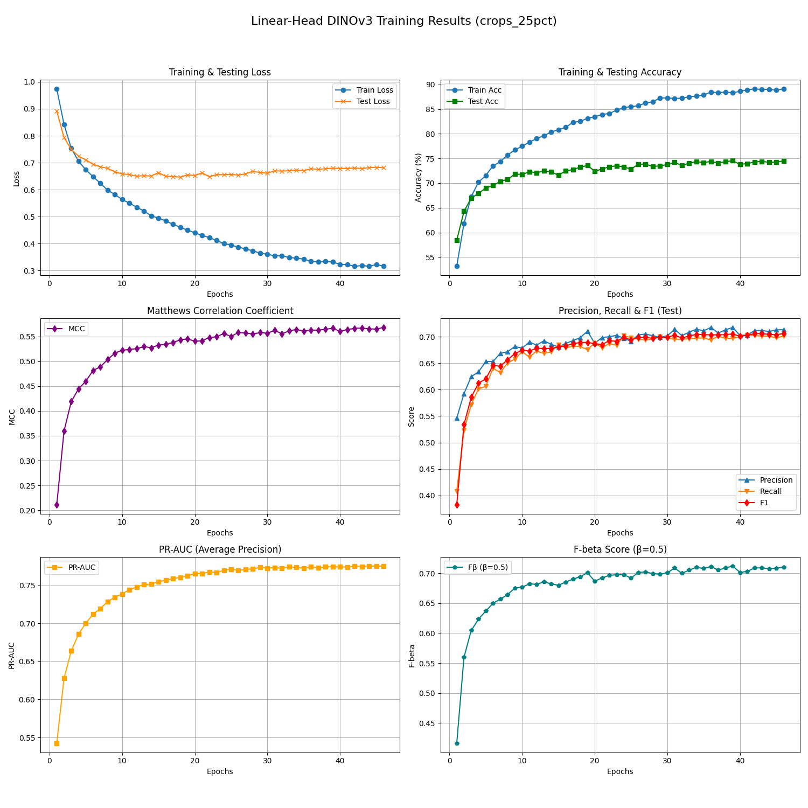
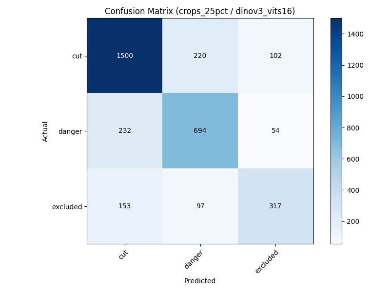

# FGVC DINOv3 with Linear Head (LoRA PEFT)

Meta의 **DINOv3** 백본(Backbone) 네트워크에 PEFT(LoRA) 기법과 선형 분류 헤드(Linear Head)를 결합하여 철스크랩(Iron-Scraps) 데이터셋의 미세 분류(Fine-Grained Visual Categorization, FGVC)를 수행하는 프로젝트입니다.

---

## 📌 주요 특징
* **Backbone**: DINOv3 (`vit_s16`, `vit_b16`, `vit_l16`, 'vit_h16plus' 사용)
* **Efficient Fine-Tuning**: LoRA(Low-Rank Adaptation)를 통한 매개변수 효율적 튜닝 (`qkv`, `proj` 타겟팅)
* **Dataset**: 보고넷 철스크랩 데이터셋 (crops 0%, 10%, 25% 비율 분할본 적용)
* **Hyperparameter Optimization**: `Optuna`를 이용한 하이퍼파라미터 자동 최적화 지원

---

## ⚙️ 준비 사항 (Setup)

### 1. DINOv3 공식 레포지토리 클론
프로젝트 루트 폴더 내에 Meta의 공식 DINOv3 레포지토리를 클론해 주세요.
```bash
git clone https://github.com/facebookresearch/dinov3.git
```

### 2. 프리트레인 가중치 배치
공식 레포지토리에서 다운로드한 백본 가중치(`.pth`) 파일들을 아래 경로 규격에 맞춰 배치합니다.
> [!IMPORTANT]
> **가중치 배치 경로**: `models/dino/weights/backbone/`

---

## 📂 프로젝트 구조 (Directory Structure)
```
├── README.md
├── hyperparams.yaml              # 학습 하이퍼파라미터 및 가중치 경로 설정
├── data/                         # 철스크랩 원본 및 분할 데이터셋
├── dinov3/                       # Meta DINOv3 공식 레포지토리
├── linear_head/                  # 분류기 학습 및 평가 모듈
│   ├── train_utils/              # 부가 학습 기능 모듈
│   │   └── run_optuna.py         # Optuna 기반 하이퍼파라미터 최적화(HPO) 실행 스크립트
│   ├── test_utils/               # 테스트 관련 부가 기능 모듈
│   ├── get_data_loaders.py       # 데이터셋 전처리 및 로더 정의
│   ├── main.py                   # 전체 파이프라인(학습/평가) 실행 엔트리포인트
│   ├── train.py                  # 모델 학습(Train) 로직
│   ├── validate.py               # 모델 검증(Validate) 로직
│   └── test.py                   # 최종 테스트(Test) 로직
├── models/
│   └── dino/
│       └── weights/
│           ├── backbone/         # <-- **다운로드한 DINOv3 가중치 (.pth)**
│           └── linear-peft-lora/ # LoRA 학습 완료된 체크포인트 파일
└── results/                      # 성능 메트릭 요약 및 그래프 저장소
```

---

## 🚀 실행 가이드 (Usage)
프로젝트 패키지 및 런타임 관리에 `uv`를 사용합니다.

```bash
# 0. 사전 준비
git clone https://github.com/facebookresearch/dinov3.git # 가중치 파일 저장, 원하는 데이터셋 준비

# 1. 가상환경 및 의존성 동기화
uv sync

# 2. 학습 및 검증 파이프라인 수행 (단일 학습)
uv run python3 -m linear_head.main

# 3. 하이퍼파라미터 최적화 (HPO) 파이프라인 수행 (Optuna)
# 실행 후 터미널 출력을 통해 최적의 파라미터가 제시되며, 별도 가중치는 저장되지 않습니다.
uv run python3 -m linear_head.train_utils.run_optuna
```

---

## 📊 학습 결과 예시 (Training Metrics) **[아래와 같은 결과물들이 나옵니다]**
> **Configuration**: `dinov3_vits16` on `crops_25pct` | **Best Epoch**: 39

| Metric | Value |
| :--- | :--- |
| **Train Loss** | 0.3319 |
| **Train Accuracy** | 88.30% |
| **Test Loss** | 0.6797 |
| **Test Accuracy** | 74.53% |
| **Precision** | 0.7175 |
| **Recall** | 0.6968 |
| **F1 Score** | 0.7053 |
| **MCC** | 0.5664 |
| **PR-AUC** | 0.7746 |
| **F-beta (0.5)** | 0.7121 |

---

## 📈 시각화 자료 (Visualization)

### 1. 학습 곡선 (Learning Curve)


### 2. 혼동 행렬 (Confusion Matrix)


### 3. 어텐션 히트맵 (Attention Map)

</details>

